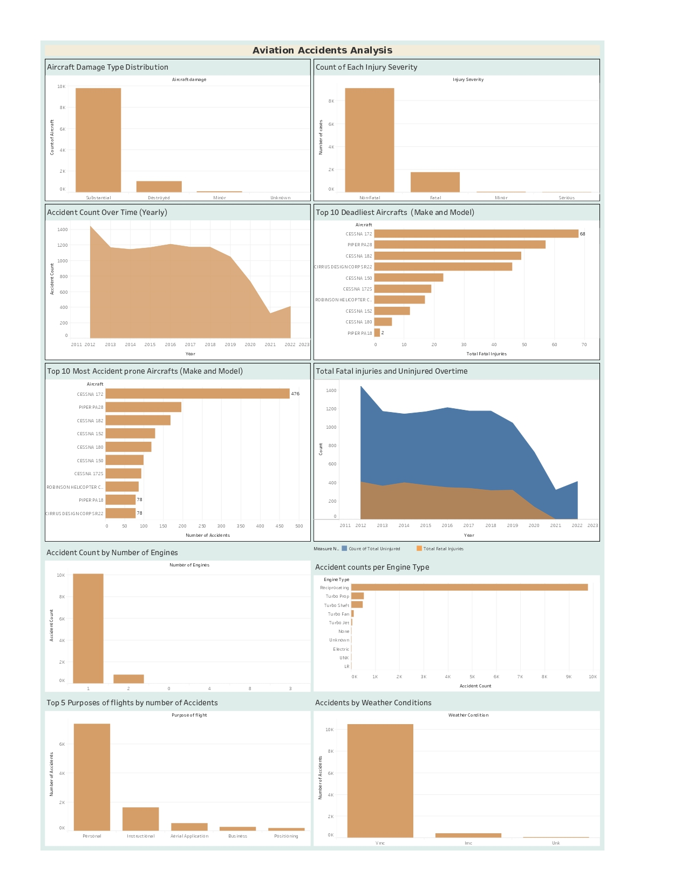

# Evaluating Low-Risk Aircraft for Growth in Aviation Ventures

## Business Problem
 As part of its strategy to diversify operations, the company is expanding into the aviation industry with plans to purchase and operate aircraft for both commercial and private purposes. However, the organization currently lacks domain knowledge about the risks associated with different aircraft types. To support the new aviation division, this project analyzes National Transportation Safety Board (NTSB) Aviation Accident data to identify aircraft models with the lowest risk profiles in terms of operational safety and performance.

## Data Understanding

### Data Source  
The dataset was sourced from the [National Transportation Safety Board](https://www.kaggle.com/datasets/khsamaha/aviation-accident-database-synopses) via Kaggle and contains historical aviation safety records of incidents and accidents involving various aircraft types, starting from 1962.

### Data Preparation
To ensure the data reflected modern aviation standards, records from **2012 to 2022** were selected. Given the significant evolution in aviation technology, safety practices, and regulations since 1962, older records may not accurately represent current industry realities.  

The dataset was also cleaned to remove:
- Inconsistencies  
- Incomplete entries (Dropped columns that had missing value >30%) 
- Irrelevant fields (such as `Latitude`, `Longitude`, `Airport Code`, and `Airport Name`)  

These fields were dropped because they were missing large amount of data and the analysis did not focus on location-based patterns. This cleaning process enhanced the overall quality and relevance of the dataset for assessing aircraft risk.

### Objectives
This project aims to:
- Determine aircraft models with the lowest operational risk
- Examine historical aviation incident data, including aircraft types and contributing operational factors
- Deliver clear, data-driven recommendations to support the aviation division in selecting aircraft for initial investment
- Reduce potential liabilities and support a safer, more informed entry into the aviation sector

### Key Variables Used in the Analysis

The following variables were identified as most relevant for assessing aircraft safety and operational risk:

- **Make and Model**: Specifies the manufacturer and model of the aircraft.
- **Injury Severity**: Indicates whether the accident resulted in fatal or non-fatal injuries.
- **Total Fatal Injuries**: The number of fatalities per accident.
- **Total Serious Injuries**: The number of serious injuries per accident.
- **Meteorological Conditions**: Specifies whether the accident occurred under Visual Meteorological Conditions (VMC) or Instrument Meteorological Conditions (IMC).
- **Engine Type**: Type of engine powering the aircraft (e.g., Reciprocating, Turbo Shaft, Turbo Prop, Turbo Fan).
- **Number of Engines**: The number of engines on the aircraft.
- **Registration Number**: A unique identifier for each aircraft which helps track individual incident records.
- **Purpose of Flight**: Describes the intended use of the aircraft during the incident (personal, business, instructional), offering insight into usage patterns and associated risk.
- **Year**: Extracted from the `Event_Date` column to facilitate time-based trend analysis.

### Relevance to Analysis
The selected variables provides valuable insights into accident trends, fatality rates, and aircraft damage levels. These insights are relevant to assessing the likelihood and severity of aviation incidents, as well as factors that influence aircraft performance and safety.

## Analysis Overview
To assess the **severity and patterns of aircraft accidents**, we performed the following:

- Created **additional derived columns** to classify the level of risk (*High Risk* or *Low Risk*) based on variables helped evaluate whether a specific aircraft model posed a greater operational risk.
- Conducted trend analyses of:
  - Injury severity (Fatal, Serious, Minor, None)
  - Accident frequency over time (2012–2022)
  - Trends in fatalities and uninjured passengers over the years

I also analyzed factors that influence aircraft safety:
- Engine reliability: by assessing the frequency and severity of accidents across different engine types (Turbo Prop vs. Turbo Fan).
- Aircraft configuration: including make, model, registration number, engine type, and number of engines.
- Purpose of flight: understanding whether certain flight types (business, personal) are associated with higher accident risks.

I also explored accident counts per Make & Model combinations to determine which aircraft were most frequently involved in accidents, especially those with fatal outcomes. This helped identify models associated with higher risk profiles.

For a detailed breakdown of the analysis, please refer to the full notebook: [Aviation.ipynb](https://github.com/Hafsa-mohamed-Ad3n/Evaluating-Low-Risk-Aircraft-for-Growth-in-Aviation-Ventures/blob/main/aviation.ipynb)

## Key Findings & Results
I created an interactive Tableau dashboard to present the results of the analysis in a clear and accessible way.

[View the Tableau Dashboard](https://public.tableau.com/app/profile/hafsa.mohammed.aden/viz/AviationAnalysisVisualization/Dashboard11)

[PDF of Dashboard](./Dashboard.pdf)

### Observations:

- Aircraft with one or two engines accounted for the highest number of accidents, while aircraft equipped with eight engines showed significantly fewer accidents, suggesting that a higher number of engines may contribute to greater safety.
- In terms of engine type, aircraft with reciprocating engines and turbo variants (turbo-prop, turbo-shaft, turbo-fan, turbo-jet) experienced the most accidents. In contrast, aircraft powered by electric engines recorded the least accidents, indicating a higher level of safety.
- The majority of aircraft makes and models experienced substantial or complete damage during incidents, indicating a higher level of risk associated with acquiring them. Only a few aircraft types recorded minor or no damage, suggesting a lower risk profile.
- Overall, aviation safety has shown improvement in recent years, indicating advancements in industry standards and practices. The number of non-fatal incidents consistently exceeded fatal incidents, which is a positive sign. The injury severity has also been decreasing over time, further highlighting the progress made in enhancing aviation safety.
- Although the Cessna 172 aircraft recorded the highest number of accidents (476), the Cirrus Design Corp SR22 had fewer total accidents (78) but accounted for the highest number of fatal accidents, making it the deadliest aircraft.
- Aircrafts with minimal accidents such as the Rans S6S, Hawk Arrow II, and Kitfox Super Sport suggest that factors like design, usage, or operational procedures may contribute to their safety.
- The Quicksilver aircraft make has been involved in a notably high number of incident counts, suggesting a greater need for frequent maintenance, raising concerns about its long-term reliability.
- Aircraft engaged in personal and instructional activities exhibited a significantly higher number of incidents, indicating greater exposure to risk compared to other types of flight operations. Specialized aircraft missions such as firefighting, air drops, and glider towing reported relatively low incident rates.
- Weather conditions have a significant impact on aviation accidents. Visual Meteorological Conditions (VMC) are associated with the highest number of accidents, likely due to increased flight activity.

### Recomendations
. Prioritize Aircraft with Higher Engine Counts and Electric Engines for Improved Safety and Reliability
   - Focusing on aircraft with more engines has shown to significantly reduce the risk of accidents, indicating a clear correlation between the number of engines and improved safety. It is recommended that the company prioritize acquiring aircraft with higher engine counts.
   - Transitioning to electric engines for new fleet acquisitions will improve safety while reducing long-term operational costs. This shift would not only boost reliability but also position the company as a forward-thinking player in the evolving aviation industry.

Make & Model Combinations
   - Purchasing aircraft based on historical safety performance, accident records, and maintenance requirements is essential to reduce operational risks and ensure long-term reliability.
   - It is advised that the company avoid acquiring aircraft like the Quicksilver, which has been associated with a higher number of incidents, or any aircraft linked to fatal accidents. Instead, the company should prioritize aircraft models with fewer or no accidents. Aircraft such as the Cessna T210L and Beech B23 exhibit greater durability and therefore should be considered safer options.

Strategic Recommendations for Improving Aircraft Safety and Minimizing Risk
   - The company should develop operational strategies that prioritize Instrument Meteorological Conditions (IMC), as these conditions have been associated with fewer accidents compared to Visual Meteorological Conditions (VMC).
   - When planning flight purposes, it is advisable to focus on specialized aircraft missions, such as firefighting, air drops, and glider towing, which have shown lower incident rates. In contrast, aircraft used for personal and instructional activities have exhibited a significantly higher number of incidents, highlighting the greater exposure to risk associated with these types of flights.

## Conclusion

The analysis of historical aviation data has provided valuable insights into aircraft safety and risks, offering guidance for making more informed purchasing decisions.

However, the results are influenced by missing or unreliable data, such as unknown weather conditions, and external factors like the phase of the accident (takeoff or landing), which may be linked to pilot actions rather than the aircraft itself.

If you have any suggestions or inquiries on how to improve this analysis, you can connect with me on [LinkedIn](https://www.linkedin.com/in/hafsa-m-aden-330451223/). I am open to feedback and would love to discuss ways to refine and enhance the analysis further.

